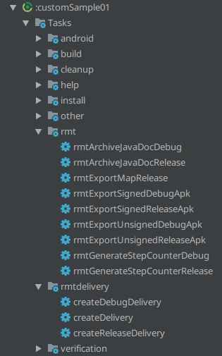

Custom-Build-Scripts
======

These are a set of helper methods to help set up Gradle tasks for commonly used actions.  To use this in your Android Studio Gradle projects, apply this script into your module by adding:
```gradle
apply from: 'https://rexmtorres.github.io/Custom-Build-Scripts/scripts/rmt.gradle'
```

<br/>  

Available Methods
======

After applying the script, you will have access to the following methods described below.

## **exportAar**
Exports the AAR and extracts the JAR (inside the AAR) into the specified location renaming the files to the specified name.
  
```gradle
exportAar(variant, destFolder, baseFileName)
```
* **variant**: *LibraryVariant* - library build variant to be processed
* **destFolder**: *String* - path to where the AAR and JAR files will be exported
* **baseFileName**: *String* - file name to be used for the AAR and JAR files
(i.e. output files => *&lt;baseFileName>.aar* and *&lt;baseFileName>.jar*)

##### See also [libraryVariants](https://google.github.io/android-gradle-dsl/current/com.android.build.gradle.LibraryExtension.html#com.android.build.gradle.LibraryExtension:libraryVariants), [build variants](https://developer.android.com/studio/build/build-variants)

---

## **exportApk**
Exports the APK into the specified location.

```gradle
exportApk(variant, destFolder, baseFileName, unsignApk)
```
* **variant**: *ApplicationVariant* - application build variant to be processed
* **destFolder**: *String* - path to where the APK file will be exported
* **baseFileName**: *String* - file name to be used for the APK file (i.e. output file => *&lt;baseFileName>.apk*)
* **unsignApk**: *boolean* - indicates whether to remove the signing info from the exported file
(if originally signed)

##### See also [applicationVariants](https://google.github.io/android-gradle-dsl/current/com.android.build.gradle.AppExtension.html#com.android.build.gradle.AppExtension:applicationVariants), [build variants](https://developer.android.com/studio/build/build-variants)

---

## **exportProguardMapping**
Copies the Proguard map files into a specified location.

```gradle
exportProguardMapping(variant, outputFolder)
```
* **variant**: *BaseVariant* - build variant to be processed
* **outputFolder**: *String* - path to where the Proguard map files will be placed

##### See also [BaseExtension](https://google.github.io/android-gradle-dsl/current/com.android.build.gradle.BaseExtension.html), [build variants](https://developer.android.com/studio/build/build-variants), [libraryVariants](https://google.github.io/android-gradle-dsl/current/com.android.build.gradle.LibraryExtension.html#com.android.build.gradle.LibraryExtension:libraryVariants), [applicationVariants](https://google.github.io/android-gradle-dsl/current/com.android.build.gradle.AppExtension.html#com.android.build.gradle.AppExtension:applicationVariants)

---

## **createJavaDoc**
Generates JavaDoc with support for embedding code snippets with syntax highlighting through [SyntaxHighlighter v3.0.83](http://alexgorbatchev.com/SyntaxHighlighter/) from Alex Gorbatchev.

```gradle
createJavaDoc(variant, additionalSourceFiles, additionalClasspathFiles, excludedFiles, javaDocTitle, javadocMemberLevel, archiveName, outputPath)
```
* **variant**: *BaseVariant* - build variant to be processed
* **additionalSourceFiles**: *ConfigurableFileCollection* - additional source files to be included in the Javadoc.  May be null.  The default source files point to: ***variant.javaCompile.source***
* **additionalClasspathFiles**: *ConfigurableFileCollection* - - additional classes to be referenced in the Javadoc.  May be null.  The default class path points to: ***variant.javaCompile.classpath.files, android.jar, annotations.jar***
* **excludedFiles**: *List* - list of source files to be excluded from the Javadoc.  May be null.
* **javaDocTitle**: *String* - Javadoc title
* **javadocMemberLevel**: *[JavadocMemberLevel](https://docs.gradle.org/current/javadoc/org/gradle/external/javadoc/JavadocMemberLevel.html)* - visibility level of the classes, methods, variables to be included in the Javadoc.  This corresponds to the *-public*, *-protected*, *-package* and *-private* options of the Javadoc executable.
* **archiveName**: *String* - file name of the zip file to be created that will contain the generated Javadoc.
* **outputPath**: *String* - path to where the Javadoc zip file will be placed

**Note:**<br/>
<sub>I'm thinking of deprecating this API.  The original purpose of this API was to generate Javadocs w/ UML diagams generated through the [yWorks UML Doclet](https://www.yworks.com/downloads#yDoc) from yWorks and have code snippets w/ syntax highlighting through [SyntaxHighlighter](http://alexgorbatchev.com/SyntaxHighlighter/) from Alex Gorbatchev.  While configuring your own [Javadoc](https://docs.gradle.org/current/dsl/org.gradle.api.tasks.javadoc.Javadoc.html) task gives you much more flexibility, setting up yWorks was a pain.  And so, I created this helper function to ease the set up.  Unfortunately, ***yWorks UML Doclet is not compatible w/ Java 8 and newer versions***.  So, I had to remove yWorks set up in this API.  In which case, you would probably be better of configuring your own [Javadoc](https://docs.gradle.org/current/dsl/org.gradle.api.tasks.javadoc.Javadoc.html) tasks.  This API still supports SyntaxHighlighter, though.</sub>

---

## **calculateLinesOfCode**
Generates step count of the source code using [Amateras StepCounter](http://amateras.osdn.jp/cgi-bin/fswiki/wiki.cgi?page=StepCounter).
  
  ```gradle
  calculateLinesOfCode(variant, outputDir, outputFile)
  ```
  * **variant**: *BaseVariant* - build variant to be processed
  * **outputDir**: *String* - path to where the step count file will be placed
  * **outputFile**: *String* - file name of the step count file

<br/>  

Usage
======

The methods will generate several Gradle tasks.  Most of them will be categorized into the `rmt` group.  However, the main task to take note of is the **`createDelivery`** task, and its variant-specific alternatives, which you can find under the `rmtDelivery` group.  Simply execute the **`createDelivery`** to start assembling your module, exporting the AAR/JAR/APK files, and generating the Javadoc, step count and Proguard map files.



<br/>  

## Library Module Example

Below is an example of a library module using [**exportAar()**](#exportaar), [**calculateLinesOfCode()**](#calculatelinesofcode) and [**createJavaDoc()**](#createjavadoc):
```gradle
apply from: 'https://rexmtorres.github.io/Custom-Build-Scripts/scripts/rmt.gradle'

android {
    // ...

    def libName = "MyLibrary"

    libraryVariants.all { variant ->
        def flavorName = variant.flavorName
        def buildTypeName = variant.buildType.name
        def variantName = variant.name
        def variantPath = variant.dirName
        def baseJarName = "${libName}_v${defaultConfig.versionName}"
        def destFolder = "${project.rootProject.buildDir}/${libName}/${variantPath}"

        // Export the AAR and JAR files
        exportAar(variant, destFolder, baseJarName)

        // Generate step count using Amateras StepCounter
        calculateLinesOfCode(variant,
                "${project.rootProject.rootDir}/stepCounter/${project.name}/${variantPath}",
                "${libName}.csv")

        // Javadoc
        def javadocTitle = "${libName} [${buildTypeName.capitalize()}] - v${defaultConfig.versionName} API Reference"
        def archiveName = "${variantPath}/${libName}_javadoc"

        createJavaDoc(variant,
                null,                                                               // no additional sources
                files("$project.buildDir/intermediates/classes/${variantPath}"),    // add a class reference so that JavaDoc can still find the excluded classes
                ['**/R.java', '**/internal/**/*.java'],      // exclude these files
                javadocTitle, JavadocMemberLevel.PROTECTED,
                archiveName, destFolder)
    }
}
```

<br/>  

## Application Module Example

Below is an example of an application module using [**exportApk()**](#exportapk), [**calculateLinesOfCode()**](#calculatelinesofcode), [**exportProguardMapping()**](#exportproguardmapping) and [**createJavaDoc()**](#createjavadoc):
```gradle
apply from: 'https://rexmtorres.github.io/Custom-Build-Scripts/scripts/rmt.gradle'

android {
    // ...

    def appName = "MyApplication"

    applicationVariants.all { variant ->
        def flavorName = variant.flavorName
        def buildTypeName = variant.buildType.name
        def variantName = variant.name
        def variantPath = variant.dirName
        def baseApkName = "${appName}_v${defaultConfig.versionName}"
        def destFolder = "${project.rootProject.buildDir}/${appName}/${variantPath}"

        // Export signed and unsigned APKs
        exportApk(variant, "${destFolder}/signed/", baseApkName, false)
        exportApk(variant, "${destFolder}/unsigned/", baseApkName, true)

        // Generate step count using Amateras StepCounter
        calculateLinesOfCode(variant,
                "${project.rootProject.rootDir}/stepCounter/${project.name}/${variantPath}",
                "${appName}.csv")

        // Only obfuscated projects have Proguard maps
        if (variant.buildType.minifyEnabled) {
            exportProguardMapping(variant,
                    "${project.rootProject.rootDir.absolutePath}/proguardMap/${project.name}/${variantPath}/${baseApkName}")
        }

        // Javadoc
        def javadocTitle = "${appName} [${buildTypeName.capitalize()}] - v${defaultConfig.versionName} API Reference"
        def archiveName = "${variantPath}/${appName}_javadoc"

        createJavaDoc(variant,
                null,                                                               // no additional sources
                files("$project.buildDir/intermediates/classes/${variantPath}"),    // add a class reference so that JavaDoc can still find the excluded classes
                ['**/R.java', '**/internal/**/*.java'],      // exclude these files
                javadocTitle, JavadocMemberLevel.PROTECTED,
                archiveName, destFolder)
    }
}
```
