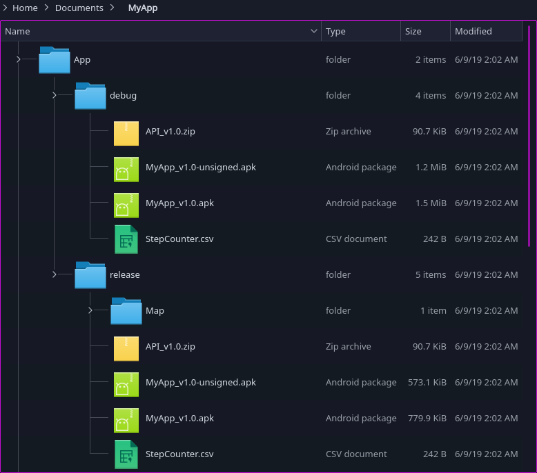

[  ](https://bintray.com/rainai/maven/packager/_latestVersion)
[](https://travis-ci.com/rexmtorres/Custom-Build-Scripts)


Introduction
============

Packager Plugin is a Gradle plugin to help you package your Android artifacts for delivery.  This is useful if you want to automatically gather and rename your binaries (APK, AAR, JAR), Javadoc, Proguard map and step counter information into a desired location so that you can easily package them for delivery, instead of having to manually look for those files in the build folder to copy and rename them.

It can automatically do the following for you:
- Copy and rename signed/unsigned APKs of your applicatoin module(s) into a specified location.
- Copy and rename AAR files of your library module(s) into a specified location.
- Extract and rename classes.jar inside an AAR file into a specified location.  *This is useful in cases where you or your client can only use JAR dependencies.*
- Export Proguard map files into a specified location.
- Generate and export step counter information of your source code using [Amateras StepCounter](http://amateras.osdn.jp/cgi-bin/fswiki/wiki.cgi?page=StepCounter).
- Generate Javadoc with optional code snippet syntax highlighting using [SyntaxHighlighter v3.0.83](http://alexgorbatchev.com/SyntaxHighlighter/) (by Alex Gorbatchev) and export it into the specified zip file.

<br/>

Usage
=====

Plugin Application
------------------
You can apply the plugin to your project in 2 ways:
- [Plugins DSL](https://docs.gradle.org/current/userguide/plugins.html#sec:plugins_block):<br/>
**build.gradle**

    ```gradle
    plugins {
        id 'com.rmt.android.packager' version '0.1.1'
    }
    ````
- [Legacy Method](https://docs.gradle.org/current/userguide/plugins.html#sec:old_plugin_application):<br/>
**build.gradle**

    ```gradle
    buildscript {
        repositories {
            jcenter()
        }
        dependencies {
            classpath group: 'com.rmt.android', name: 'packager', version: '0.1.1'
        }
    }

    apply plugin: 'com.rmt.android.packager'
    ````

<br/>

Available APIs
--------------

The plugin provides the `packager` extension with the following APIs:

### <a name="debug"></a>`boolean debug`

This flag enables/disables debug messages, which is useful for troubleshooting your configuration if you're experiencing errors or unexpected behavior.  If set to `true`, debug messages will be printed.  This is `false` by default.

<br/>

### <a name="app"></a>`void app(`[Closure](http://docs.groovy-lang.org/docs/groovy-latest/html/api/groovy/lang/Closure.html) `appClosure)`

Configures an Android application artifact to be packaged.

Usage:
```gradle
    packager {
        app {
            variant = <ApplicationVariant>
            apkFile = <File>
            unsignedApkFile = <File>
            proguardMapDir = <File>
        }
    }
```
Property          | Description
----------------: | :----------
`variant`         | The build variant of the application to be packaged. This property is *mandatory*.
`apkFile`         | The file to where the APK will be exported. Note that this may be a signed or unsigned APK depending on the signing configuration. **If this points to an existing file, that file will be overwritten.** This property is optional *if* `unsignedApkFile` is already defined; that is, at least one of them must be present. If this is not specified, then only `unsignedApkFile` will be exported.
`unsignedApkFile` | The file to where the unsigned APK will be exported. **If this points to an existing file, that file will be overwritten.** This property is optional *if* `apkFile` is already defined; that is, at least one of them must be present. If this is not specified, then only `apkFile` will be exported.
`proguardMapDir`  | The directory where the Proguard map files will be exported. This property is *optional*. If this is not specified, then the Proguard map files will not be exported.

<br/>

### <a name="lib"></a>`void lib(`[Closure](http://docs.groovy-lang.org/docs/groovy-latest/html/api/groovy/lang/Closure.html) `libClosure)`

Configures an Android library artifact to be packaged.

Usage:
```gradle
    packager {
        lib {
            variant = <LibraryVariant>
            aarFile = <File>
            jarFile = <File>
            proguardMapDir = <File>
        }
    }
```
Property         | Description
---------------: | :----------
`variant`        | The build variant of the application to be packaged. This property is *mandatory*.
`aarFile`        | The file to where the AAR will be exported. **If this points to an existing file, that file will be overwritten.** This property is optional *if* `jarFile` is already defined; that is, at least one of them must be present. If this is not specified, then only the JAR file will be exported.
`jarFile`        | The file to where the JAR will be exported. **If this points to an existing file, that file will be overwritten.** This property is optional *if* `aarFile` is already defined; that is, at least one of them must be present. If this is not specified, then only the AAR file will be exported.
`proguardMapDir` | The directory where the Proguard map files will be exported. This property is *optional*. If this is not specified, then the Proguard map files will not be exported.

<br/>

### <a name="javadoc"></a>`void javadoc(`[Closure](http://docs.groovy-lang.org/docs/groovy-latest/html/api/groovy/lang/Closure.html) `javadocClosure)`

Configures Javadoc artifact to be packaged.

Note that this uses [SyntaxHighlighter v3.0.83](http://alexgorbatchev.com/SyntaxHighlighter/) to beautify code snippets in your Javadoc.

Usage:
```gradle
    packager {
        javadoc {
            variant = <BaseVariant>
            outputZipFile = <File>
            javadocTitle = <String>
            windowTitle = <String>
            failOnError = <boolean>
            javadocMemberLevel = <JavadocMemberLevel>
            additionalSourceFiles = <ConfigurableFileCollection>
            additionalClasspathFiles = <ConfigurableFileCollection>
            excludes = <List<String>>
            optionsFile = <String>
        }
    }
```
Property                   | Description
-------------------------: | :----------
`variant`                  | The build variant of the application to be packaged. This property is *mandatory*.
`outputZipFile`            | The zip file to where the Javadoc will be stored. **If this points to an existing file, that file will be overwritten.** This property is *mandatory*.
`javadocTitle`             | The title of the Javadoc to be generated. This property is *optional*.
`windowTitle`              | The title to be displayed on the browser window. This property is *optional*.
`failOnError`              | If set to `true`, aborts the Javadoc generation if there are errors in the Javadoc comments. Otherwise, attempt to continue. This property is *optional* and is `false` by default.
`javadocMemberLevel`       | Specifies which members are included in the Javadoc based on their visibility level. This value maps to the `-public`, `-protected`, `-package` and `-private` options of the `javadoc` executable. This property is *optional* and defaults to [JavadocMemberLevel.PROTECTED](https://docs.gradle.org/current/javadoc/org/gradle/external/javadoc/JavadocMemberLevel.html#PROTECTED).
`additionalSourceFiles`    | List of additional source files to be included in the Javadoc. This property is *optional*. The variant's source files are already included, so there's no need to add them in this property.
`additionalClasspathFiles` | List of additional class paths used to resolve type references in the source codes. This property is *optional*. The variant's classpath as well as the Android library are already included, so there's no need to add them in this property.
`excludes`                 | Set of patterns for files to be excluded from Javadoc. This property is *optional*.
`optionsFile`              | File containing a list of additional Javadoc tool options. This property is *optional*.

<br/>

### <a name="stepCounter"></a>`void stepCounter(`[Closure](http://docs.groovy-lang.org/docs/groovy-latest/html/api/groovy/lang/Closure.html) `stepCounterClosure)`

Configures an [Amateras StepCounter](https://github.com/takezoe/stepcounter) artifact to be packaged.

Usage:
```gradle
    packager {
        stepCounter {
            variant = <BaseVariant>
            outputCsvFile = <File>
            additionalSourceFiles = <ConfigurableFileCollection>
            includes = <List<String>>
            excludes = <List<String>>
        }
    }
```
Property                | Description
----------------------: | :----------
`variant`               | The build variant of the application to be packaged. This property is *mandatory*.
`outputCsvFile`         | The CSV report file to be generated. **If this points to an existing file, that file will be overwritten.* This property is *mandatory*.
`additionalSourceFiles` | List of additional source files to be included in the report. This property is *optional*. The variant's source files are already included, so there's no need to add them in this property.
`includes`              | Set of patterns for files to be included in the report. This property is *optional*.
`excludes`              | Set of patterns for files to be excluded in the report. This property is *optional*.

<br/>

For more information on the plugin APIs, you can refer to the [API documentation](docs/groovy/index.html).

<br/>

Generated Tasks
---------------

The methods described above will generate the following main Gradle tasks in the `packager` group:
Task                    | Description
----------------------: | :----------
`createPackage`         | This is the main task that executes all the other tasks described below.  It will also call your modules' `assemble` tasks.
`phExportApp`           | This is generated by the [app](#app) closure.  Executing this task will, in turn, call all the generated `phExport`*Variant*`Apk` and/or `phExport`*Variant*`UnsignedApk` as well as the `phExport`*Variant*`ProguardMap` tasks for your application module.
`phExportLib`           | This is generated by the [lib](#lib) closure.  Executing this task will, in turn, call all the generated `phExport`*Variant*`Aar` and/or `phExport`*Variant*`Jar` as well as the `phExport`*Variant*`ProguardMap` tasks for your library module.
`phGenerateJavadoc`     | This is generated by the [javadoc](#javadoc) closure.  Executing this task will, in turn, call all the generated `phGenerateJavadocFor`*Variant* tasks.
`phGenerateStepCounter` | This is generated by the [stepCounter](#stepCounter) closure.  Executing this task will, in turn, call all the generated `phGenerateStepCounterFor`*Variant* tasks.

<br/>

Other tasks are also generated in the `phothers` group.  You will, generally, not need to call them directly.
Task                                | Description
----------------------------------: | :----------
`phExport`*Variant*`Apk`            | This exports the APK of the specified variant to the location indicated by `apkFile` in the [app](#app) closure.  Note that this does not modify the original APK in the build folder.
`phExport`*Variant*`UnsignedApk`    |  This removes the signature of the APK of the specified variant and exports it to the location indicated by `unsignedApkFile` in the [app](#app) closure.  Note that this does not modify the original APK in the build folder.
`phExport`*Variant*`Aar`            | This exports the AAR of the specified variant to the location indicated by `aarFile` in the [lib](#lib) closure.  Note that this does not modify the original AAR in the build folder.
`phExport`*Variant*`Jar`            |  This extracts the JAR file (classes.jar) in the AAR of the specified variant and exports it to the location indicated by `jarFile` in the [lib](#lib) closure.  Note that this does not modify the original AAR in the build folder.
`phExport`*Variant*`ProguardMap`    | This copies the Proguard map files of the specified variant to the location indicated by `proguardMapDir` in the [app](#app) / [lib](#lib) closures.
`phGenerateJavadocFor`*Variant*     | This generates the Javadoc of the specified variant and exports the zipped documentation to the location indicated by `outputZipFile` in the [javadoc](#javadoc) closure.  Note that this applies [SyntaxHighlighter](http://alexgorbatchev.com/SyntaxHighlighter/) to your Javadoc, so you can take advantage of fancy formatting for your code snippets in your Javadoc.
`phGenerateStepCounterFor`*Variant* | This calculates the number of lines of code in your module, for the specified variant, using [Amateras StepCounter](http://amateras.osdn.jp/cgi-bin/fswiki/wiki.cgi?page=StepCounter).  The generated CSV report is written in the location indicated by `outputCsvFile` in the [stepCounter](#stepCounter) closure.

<br/>

Examples
--------

### Application Module Example

**build.gradle**
```gradle
apply plugin: 'com.rmt.android.packager'

android {
    defaultConfig {
        // ...
        versionCode 1
        versionName "1.0"
    }
    
    buildTypes {
        release {
            minifyEnabled true
            proguardFiles getDefaultProguardFile('proguard-android.txt'), 'proguard-rules.pro'
        }
    }

    applicationVariants.all { appVariant ->
        packager {
            // Print debug logs.
            debug = true

            app {
                variant = appVariant
                apkFile = file("${rootProject.buildDir}/MyApp/App/${variant.dirName}/MyApp_v${defaultConfig.versionName}.apk")
                unsignedApkFile = file("${rootProject.buildDir}/MyApp/App/${variant.dirName}/MyApp_v${defaultConfig.versionName}-unsigned.apk")
                proguardMapDir = file("${rootProject.buildDir}/MyApp/App/${variant.dirName}/Map")
            }

            stepCounter {
                variant = appVariant
                outputCsvFile = file("${rootProject.buildDir}/MyApp/App/${variant.dirName}/StepCounter.csv")
                excludes = ["**/R.java", "**/*.json"]
            }

            javadoc {
                variant = appVariant
                javadocTitle = appVariant.name
                javadocMemberLevel = JavadocMemberLevel.PROTECTED
                excludes = ["**/BuildConfig.java", "**/R.java", "**/internal/**"]
                outputZipFile = file("${rootProject.buildDir}/MyApp/App/${variant.dirName}/API_v${defaultConfig.versionName}.zip")
            }
        }
    }
}
```

The configuration above generates the following tasks:<br/>


Executing `createPackage` yields:<br/>


<br/>

### Library Module Example

**build.gradle**
```gradle
apply plugin: 'com.rmt.android.packager'

android {
    defaultConfig {
        // ...
        versionCode 1
        versionName "1.0"
    }
    
    buildTypes {
        release {
            minifyEnabled true
            proguardFiles getDefaultProguardFile('proguard-android.txt'), 'proguard-rules.pro'
        }
    }

    libraryVariants.all { libVariant ->
        packager {
            // Print debug logs.
            debug = true

            lib {
                variant = libVariant
                aarFile = file("${rootProject.buildDir}/MyApp/Lib/${variant.dirName}/MyLib_v${defaultConfig.versionName}.aar")
                jarFile = file("${rootProject.buildDir}/MyApp/Lib/${variant.dirName}/MyLib_v${defaultConfig.versionName}.jar")
                proguardMapDir = file("${rootProject.buildDir}/MyApp/Lib/${variant.dirName}/Map")
            }

            stepCounter {
                variant = libVariant
                outputCsvFile = file("${rootProject.buildDir}/MyApp/Lib/${variant.dirName}/StepCounter.csv")
                excludes = ["**/R.java", "**/*.json"]
            }

            javadoc {
                variant = libVariant
                javadocTitle = libVariant.name
                javadocMemberLevel = JavadocMemberLevel.PROTECTED
                excludes = ["**/BuildConfig.java", "**/R.java", "**/internal/**"]
                outputZipFile = file("${rootProject.buildDir}/MyApp/Lib/${variant.dirName}/API_v${defaultConfig.versionName}.zip")
            }
        }
    }
}
```

The configuration above generates the following tasks:<br/>


Executing `createPackage` yields:<br/>

